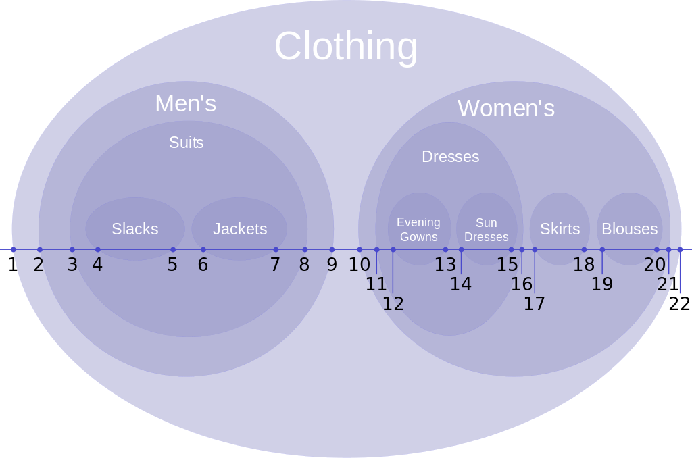
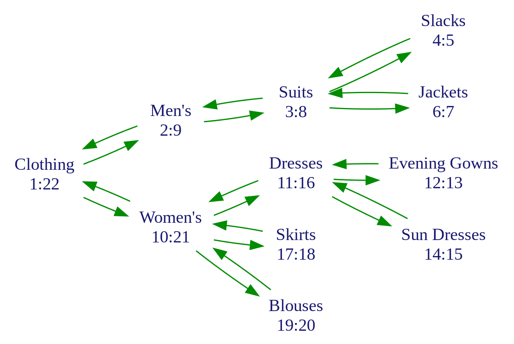

# Nested set

The [nested set model](https://en.wikipedia.org/wiki/Nested_set_model)
is a technique for representing nested sets (also known as trees or
hierarchies) in relational databases.

## Example

### A hierarchy: types of clothing:

### The numbering assigned by tree traversal:

## Installation

## Tests

If you don't have PHP but you have Docker and Docker Compose on your
system, you can run `make install`. It will install a PHP 7.1 FPM.
After the installation you can run `make shell` to connect into
the PHP container.

### Code quality

You can run a code quality check with `make phpcs` and `make phpstan`.

### Unit test

You can run PHPunit tests suite with `make phpunit`.
